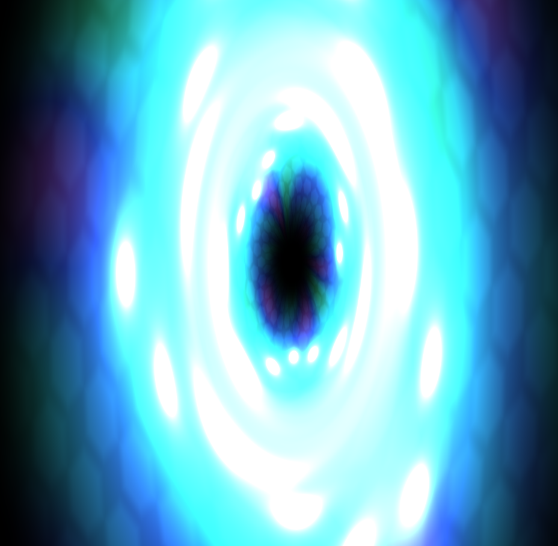

# Black Hole | Interactive WebGL Black Hole Simulation

## 🚀 Overview
**Black Hole** is an interactive WebGL demo built with [three.js](https://threejs.org/) and custom GLSL shaders. It renders a “black hole” effect with dynamic hex-grid distortion, wave ripples, and glowing particles that react to your mouse position and elapsed time.

## ✨ Features
- Real-time distortion warp based on cursor position  
- Hexagonal grid overlay with smooth edges  
- Sinusoidal wave distortion for organic motion  
- Animated particles orbiting and glowing near the cursor  
- High-precision GLSL shaders ([shader.vert](shaders/shader.vert) & [shader.frag](shaders/shader.frag))  
- Responsive canvas resize & FPS counter ([styles.css])

## Screenshots
  
*Use your mouse to distort the black hole in real time!* 

## 📂 File Structure
- [index.html](index.html) – Entry point, loads Three.js & `scripts/main.js`  
- [styles.css](styles.css) – UI styling & FPS counter  
- [scripts/main.js](scripts/main.js) – Three.js setup, shader loading, animation loop  
- [shaders/shader.vert](shaders/shader.vert) – Vertex shader  
- [shaders/shader.frag](shaders/shader.frag) – Fragment shader 

## ⚙️ Getting Started

### Prerequisites
- Any static file server (e.g. Python 3.x, Node.js `http-server`)

### Installation & Run
1. Clone this repo:
   ```sh
   git clone https://https://github.com/Cha1tanyaa/Black-Hole.git
   cd Computergraphik
   ```
2. Start a local server:
   ```sh
   # Python 3.x
   python -m http.server 8000
   # or with Node.js
   npx http-server -p 8000
   ```
3. Open your browser at <http://localhost:8000>

## 🎮 Controls
- Move your **mouse** over the canvas to interact with the distortion and particles.
- Resize your browser window—the WebGL canvas and shaders will automatically adapt to the new dimensions.

## 🛠 Built With
- [three.js r128](https://cdnjs.cloudflare.com/ajax/libs/three.js/r128/three.min.js)
- GLSL / WebGL 1.0 (via custom shaders in `shaders/`)